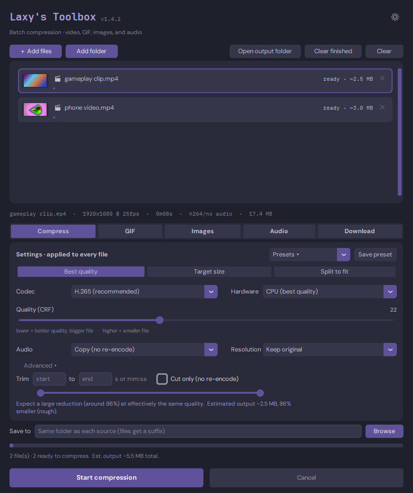

# Laxy's Toolbox

A batch media toolbox for Windows: compress videos, make GIFs, convert images
and audio, and download from links. One portable exe, no install.



## Download

Grab `Laxy.Toolbox.exe` from the
[latest release](https://github.com/Laxy-VR/LaxyToolbox/releases/latest) and
double click it. No Python, no ffmpeg, no installer needed.

> **First launch:** Windows SmartScreen may warn about an unknown app because
> the exe is not code signed. Click **More info · Run anyway**. The app also
> checks for new versions at startup and shows a link in the header when one
> is available.
>
> **Antivirus:** a VirusTotal scan shows 2 of 68 engines flagging the exe
> (Bkav and McAfee's generic scanner), with generic, hash named "detections".
> This is the usual false positive for an unsigned app that unpacks Python and
> ffmpeg at runtime. Every major engine (Microsoft Defender, Kaspersky,
> BitDefender, ESET, Sophos) reports it clean. The build is produced in the
> open by GitHub Actions from the tagged commit, so you can read exactly what
> goes into it.

## What it does

**🎬 Compress** · Re-encode videos to **H.265** (recommended), **AV1**
(smallest), or **H.264** (max compatibility), on CPU or NVIDIA GPU. Three
modes:
- **Best quality** picks settings from the video's own metadata for the
  smallest file with no visible quality loss, and predicts the output size.
- **Target size** fits any video under a limit (500 MB for Discord Nitro,
  for example) and warns if the result lands over. Small videos are never
  inflated to fill the cap: if a file already fits at full quality, it is
  encoded at best quality with the limit as a safety ceiling.
- **Split to fit** cuts a long video into parts that each fit under the limit.

Optional **Trim** (start/end seconds) on any mode with live previews of the
first and last frame you're keeping, a **Cut only** checkbox for instant
lossless trimming, **Crop** (auto **black bar removal**, vertical **9:16**
for Shorts, square **1:1**), **Rotate/flip** for sideways phone videos,
**burn in subtitles** (auto finds a matching .srt/.ass/.vtt next to each
video, or pick a file), a **Boost quiet audio** option that fixes a too
quiet mic while compressing, and **Remove audio** for gameplay clips.
HDR videos keep their 10 bit color on H.265/AV1 and are properly tone mapped
otherwise.

**🎞 GIF** · Turn a clip into a loop: classic **GIF**, **animated WebP**
(much smaller), or a silent **MP4 loop** (smallest). Scrub to the start frame
with a slider and live previews of the clip's first and last frames, then
tune the **size** (height caps that never upscale, or custom exact pixel
dimensions), speed (0.25x to 4x), direction (forward, reverse, **boomerang**),
dithering, and palette size (256/128/64 colors). **Lossy compression**
(gifsicle) squeezes GIFs another 30 to 60% at three strengths, and **Skip
still frames** drops frames where nothing moved. Also shrinks existing GIFs.

**🖼 Images** · Batch convert PNG/JPEG/BMP to **WebP**, **AVIF**, or **JPEG**
at three quality levels, with optional resizing that never upscales by
accident, and a **strip metadata** option that removes EXIF/GPS before
sharing.

**🎵 Audio** · Extract the soundtrack from any video, or convert audio files,
to MP3 or M4A, with optional **volume normalization** for quiet or harsh
recordings.

**🌐 Download** · Paste a link from YouTube, Twitter, and most sites. Pick a
max resolution or grab audio only, or turn on **Whole playlist** to fetch
every video a link points to. Downloads land in your output folder and are not
re-compressed automatically (sites already compress their videos); right click
one to queue it. DRM protected content is not supported.

**Everywhere:** drag and drop files or folders, mixed batches, thumbnail
previews, a rough **predicted output size on every queued file** (and the
batch total) before you start, live progress with speed, time remaining, and
**real taskbar progress**, per file savings and batch totals, one-click
**presets** for common jobs, right click a finished file to **copy it to the
clipboard** (Ctrl+V straight into Discord) or **save a frame** as a full
resolution PNG, plain-language tooltips, clear error messages
(hover a failed row to see why), **drag rows to reorder** the queue,
**two-handle range sliders** for trims and GIF clips with times accepted as
seconds or mm:ss, an Advanced toggle that keeps the everyday controls up
front, a warning before existing files are replaced, and a bottom bar that
stays visible on any screen size. Pick your **accent color** (purple, blue,
green, teal, rose, or amber) via the gear button.

## FAQ

- **A download failed or came out low quality.** The downloader (yt-dlp)
  updates itself automatically, and the app shows the actual resolution that
  arrived. If a site keeps serving low quality (often stuck at 360p), it distrusts
  your network: set the **Cookies** option on the Download tab to a browser
  you are signed in with, or retry later. The full log of the last download is in
  `%LOCALAPPDATA%\LaxyCompressor\last_download.log`.
- **The GPU option is missing.** The app verifies GPU encoding with a real
  test encode on first launch. No NVIDIA GPU (or a very old driver) means the
  option is hidden and everything runs on CPU.
- **Compressing a downloaded video makes it bigger.** Platform videos are
  already heavily compressed; the app tells you this in its notes. Compress
  your own recordings, not re-downloads, for real savings.
- **My GIF is still too big.** In order of impact: save as WebP or MP4 loop
  instead (far smaller, Discord plays both), turn on Lossy (30 to 60% off,
  even on already optimized GIFs), lower the frame rate or resolution, and
  use Skip still frames for screen recordings. If it must be a .gif, Strong
  lossy plus 128 colors is the squeeze combo.
- **Where are the theme colors?** The gear button in the header: six accent
  colors that restyle the whole app instantly, plus the About/credits.

## Development

Python 3.10+, [ffmpeg](https://ffmpeg.org) **full** build and
[gifsicle](https://www.lcdf.org/gifsicle/) on PATH (both are bundled into the
exe by `build.ps1`, which fails without them).

```powershell
pip install -r requirements.txt
python app.py          # run from source
pip install pytest
pytest -q              # no display needed; the real-encode smoke tests
                       # auto-skip when ffmpeg/gifsicle are not on PATH
pip install pyinstaller
./build.ps1            # build the standalone exe into dist/
```

Architecture, the release process, and hard won gotchas (ffmpeg pinning,
yt-dlp quirks) are documented in [docs/DEVELOPMENT.md](docs/DEVELOPMENT.md).
Version history is in [CHANGELOG.md](CHANGELOG.md).

## License

MIT (see [LICENSE](LICENSE)). The exe bundles third party software under
their own licenses, listed in [THIRD_PARTY.md](THIRD_PARTY.md).
