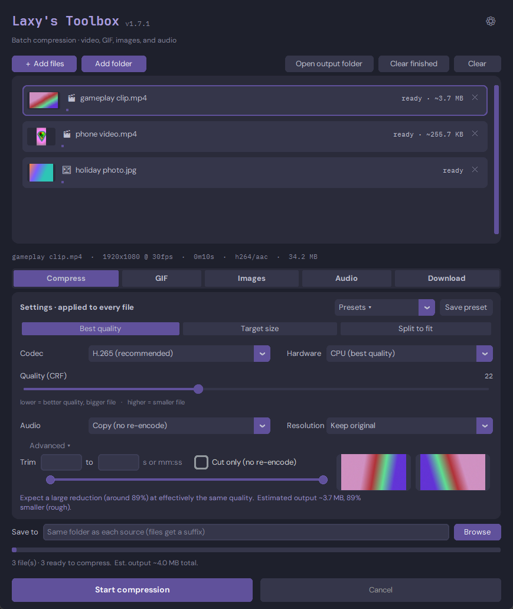

# Laxy's Toolbox

Compress videos, make GIFs, convert images and audio, and download videos
from links, all in batches. One portable Windows app: no installer, no
Python, no ffmpeg to set up.

## Download

1. Get **`Laxy.Toolbox.exe`** from the
   [latest release](https://github.com/Laxy-VR/LaxyToolbox/releases/latest).
2. Put it anywhere (Desktop, Documents, a USB stick) and double click it.

Runs on 64 bit Windows 10 and 11. A graphics card is optional: when one
works, the app offers it for much faster encodes.

> **Windows SmartScreen** may warn about an unknown app, because the exe is
> not code signed. Click **More info**, then **Run anyway**.
>
> **Antivirus:** some scanners flag unsigned apps like this one with generic
> detections, because the exe unpacks Python and ffmpeg when it starts. The
> exe is built in the open by GitHub Actions from the tagged source, and the
> release page lists its SHA256 checksum, so you can confirm your copy is the
> real one: run `Get-FileHash .\Laxy.Toolbox.exe` in PowerShell and compare.

**Updates:** the app checks for a new version when it starts. When one is
out, the version label in the header turns into an update button. Click it
and the app downloads the new version, checks it against the published
checksum, replaces itself, and restarts.

## What it does

| Tab | In short |
|---|---|
| 🎬 **Compress** | Shrink videos with H.265, AV1, or H.264: best quality, under a size limit, or split into parts |
| 🎞 **GIF** | Turn a clip into a GIF, an animated WebP, or an MP4 loop |
| 🖼 **Images** | Convert photos to WebP, AVIF, JPEG, or PNG, optionally under a size cap |
| 🎵 **Audio** | Extract or convert audio to MP3, M4A, Opus, FLAC, or WAV |
| 🌐 **Download** | Save videos or audio from YouTube, Twitter, and most other sites |

Add files with **Add files**, **Add folder**, drag and drop, or Ctrl+V. One
queue can hold videos, images, and audio together; each tab only processes
its own kind of file and leaves the rest alone.

### 🎬 Compress

**Three modes**
- **Best quality** reads each video and picks settings for the smallest file
  with no visible quality loss, and predicts the output size.
- **Target size** fits every file under a limit, such as 500 MB for Discord
  Nitro. A video that already fits at full quality is never inflated to fill
  the limit, and any result that lands over it is flagged.
- **Split to fit** cuts long videos into parts that each fit under the limit
  (pick the number of parts, or leave it on Auto).

**Codec and hardware:** H.265 (recommended), AV1 (smallest files, needs a
fairly modern device to play), or H.264 (plays on everything). Encode on the
CPU (best quality per megabyte) or on an NVIDIA, AMD, or Intel graphics card
(much faster). A graphics card is only offered after a real test encode
proves it works on your machine.

**Everyday settings:** a quality slider, audio (copy untouched, AAC,
**Boost quiet audio**, or **Remove audio**), resolution, and **Trim** with
live previews of the first and last frame you keep. **Cut only** trims
instantly without re-encoding (cut points snap to the nearest keyframe).

**Behind the Advanced toggle**
- Encoding speed preset and frame rate
- **Crop:** remove black bars automatically, vertical 9:16 for Shorts and
  TikTok, or square 1:1
- **Rotate or flip** videos recorded sideways
- **Burn in subtitles:** a matching .srt, .ass, or .vtt next to each video is
  found automatically, or pick a file
- **Denoise** grainy footage, which also makes it compress far better
- **Speed** from 0.25x to 4x, with the audio retimed to match
- **Audio track:** keep one track or mix them all, for recordings with
  separate tracks (OBS game and mic). Only appears when a queued file has
  more than one.
- **Test a 5s sample** encodes five seconds from the middle of the selected
  video with the current settings and opens it, so you can judge the quality
  before a long encode.

**Handled for you:** interlaced video is deinterlaced, 10 bit and HDR video
keeps its color on H.265 and AV1 (and is tone mapped properly otherwise),
and portrait phone videos keep their shape.

### 🎞 GIF

- Pick the clip with a two handle slider, with live previews of its first
  and last frame, or type a start time and length.
- Save as **GIF**, **animated WebP** (much smaller), or a silent
  **MP4 loop** (smallest).
- **Size:** cap the height (480p by default, never upscales), keep the
  original, or type exact pixels (leave one side blank to keep the shape).
- **Frame rate**, **speed** (0.25x to 4x), and **direction**: forward,
  reverse, or boomerang.
- For GIF output: dithering, **palette size** (256, 128, or 64 colors), and
  **Lossy** compression (gifsicle) that makes GIFs another 30 to 60% smaller,
  at three strengths.
- **Skip still frames** drops frames where nothing moves, which shrinks
  screen recordings a lot.
- Existing GIFs can be added and shrunk too.

### 🖼 Images

- Convert PNG, JPEG, WebP, BMP, TIFF, AVIF, and iPhone HEIC photos to
  **WebP**, **AVIF**, **JPEG**, or **PNG**.
- Three quality levels: High, Balanced, and Small (PNG is always lossless).
- **Max size** keeps lowering the quality, then shrinking the picture, until
  the file fits: under 10 MB, 1 MB, 512 KB (Discord stickers), or 256 KB
  (Discord emoji).
- **Resize** by 2x, 1.5x, or 0.5x, or cap the height at 2160p, 1080p, or
  720p (caps never upscale).
- **Rotate or flip**, and **Strip metadata** to remove camera details and
  GPS location before sharing.
- Transparency is kept in WebP and PNG, and placed on white (not black) for
  JPEG and AVIF.

### 🎵 Audio

- Extract the audio from videos, or convert audio files (MP3, M4A, AAC, WAV,
  FLAC, OGG, Opus, WMA).
- Save as **MP3** (plays everywhere), **M4A**, **Opus** (smallest),
  **FLAC** or **WAV** (lossless), or **Copy original** (the untouched track:
  instant, zero quality loss).
- Choose the bitrate for MP3, M4A, and Opus: 256k, 192k, or 128k.
- **Trim** a section, change the **speed** (1.5x for voice memos), pick or
  mix **tracks**, and **Normalize volume** to even out quiet or harsh
  recordings.

### 🌐 Download

- Paste a link. Pressing Ctrl+V anywhere in the app with a link copied jumps
  straight here.
- Cap the resolution (2160p, 1080p, or 720p) or take the best available,
  download **Audio only** as MP3, or grab a **Whole playlist**.
- **Cookies:** if a site only offers low quality or wants you to sign in,
  pick a browser you are signed in with (Firefox works most reliably). Only
  that browser's cookies are read, only for the download.
- Downloads go to your **Save to** folder (or your Downloads folder when it
  is empty) and join the queue. They are not compressed automatically, since
  sites already compress their videos; right click one and choose
  **Queue for compression** to include it.
- The downloader, [yt-dlp](https://github.com/yt-dlp/yt-dlp), is fetched on
  first use and keeps itself up to date. DRM protected videos can't be
  downloaded.

### Around the queue

- Every ready file shows a **predicted output size**, and the status bar
  shows the batch total, before you start.
- Live progress with encode speed and time remaining, also shown on the
  taskbar button. The taskbar flashes when a batch finishes, and your PC
  won't fall asleep mid encode.
- Finished files show how much smaller (or larger) they came out. Hover a
  failed file to read why, in plain words.
- **Presets:** one click setups (Discord under 500 MB, Discord under 10 MB,
  Archive top quality, Smallest file with AV1), and **Save preset** for your
  own.
- The app asks before replacing files that already exist, and never writes
  over a file that is in the queue.
- Drag files to reorder the queue.
- The ⚙ button picks an **accent color** (purple, blue, green, teal, rose,
  or amber) and shows the About section.

**Right click a file** to:
- **Open** it, **Reveal in folder**, or **Copy file** to paste the result
  straight into Discord or Explorer
- **Trim this file** or **Crop this file** (drag a box on a real frame).
  These apply to that one file and win over the shared settings.
- **Save a frame** as a full resolution PNG next to the video
- Move it up or down, or remove it from the queue

Double click a finished file to open it.

**Keyboard shortcuts**

| Keys | Action |
|---|---|
| Ctrl+O | Add files |
| Ctrl+V | Add copied files or folders, or paste a copied link into the Download tab |
| Enter | Start |
| Delete | Remove the selected file |
| Alt+Up, Alt+Down | Move the selected file up or down |
| Esc | Close the settings panel |

## Where your files go

Leave **Save to** empty to save each result next to its source, or pick a
folder for everything.

| Job | Output name |
|---|---|
| Compress | `clip_h265.mp4` (or `_av1`, `_h264`, after the codec used) |
| Split to fit | `clip_part1_h265.mp4`, `clip_part2_h265.mp4`, … |
| Cut only | `clip_cut.mkv` (keeps the original format) |
| GIF | `clip.gif`, `clip.webp`, or `clip_loop.mp4` |
| Images | `photo.webp`, `photo.avif`, `photo.jpg`, or `photo.png` |
| Audio | `clip.mp3`, `.m4a`, `.ogg` (Opus), `.flac`, or `.wav` |
| Save a frame | `clip_frame_12.5s.png`, next to the video |
| Download | the video's title, such as `My video.mp4` |

Converting to the same format in the same folder adds `_laxy`
(`photo_laxy.jpg`). When a name is already taken by another file in the
batch or the queue, `_2`, `_3` and so on are added. With **Copy original**
on the Audio tab, the extension follows the track's own format (`.m4a` for
AAC, for example).

## Privacy and your data

The app only goes online for two things:
- **The update check:** at startup it asks GitHub for the latest release.
  Nothing is downloaded unless you click the update button.
- **Downloads:** the first time you use the Download tab, it fetches yt-dlp
  from its official GitHub releases and checks it against the published
  checksum. yt-dlp then contacts the sites you download from, and updates
  itself about once a week.

There are no accounts, no analytics, and no tracking.

| What | Where |
|---|---|
| Settings, window size, saved presets | `%USERPROFILE%\.laxy_compressor.json` |
| The downloader, the last download log, the error log | `%LOCALAPPDATA%\LaxyCompressor\` |

**Uninstall:** delete the exe, and optionally those two locations.

## FAQ

- **A download failed or came out low quality.** The downloader updates
  itself automatically, and the app shows the resolution that actually
  arrived. If a site keeps serving low quality (often stuck at 360p), it
  distrusts your network: set **Cookies** on the Download tab to a browser
  you are signed in with, or retry later. The full log of the last download
  is `last_download.log` in `%LOCALAPPDATA%\LaxyCompressor\`.
- **The GPU option is missing.** On first launch the app verifies each GPU
  brand (NVIDIA, AMD, Intel) with a real test encode. Brands that fail (no
  such card, or a very old driver) are hidden, and everything runs on the
  CPU instead.
- **Compressing a downloaded video makes it bigger.** Videos from sites are
  already heavily compressed, and the note under the settings says so.
  Compress your own recordings for real savings.
- **My GIF is still too big.** In order of impact: save as WebP or MP4 loop
  instead, turn on Lossy, lower the frame rate or size, and use Skip still
  frames for screen recordings. If it must be a .gif, Strong lossy plus 128
  colors squeezes hardest.
- **Updating failed.** The app opens the release page instead, so you can
  download the new exe yourself. This happens when it can't replace its own
  file, for example when the exe sits in a folder that needs administrator
  rights, such as Program Files.
- **Something went wrong.** Hover the failed file for the reason. To report
  a bug, [open an issue](https://github.com/Laxy-VR/LaxyToolbox/issues) and
  attach `errors.log` (and `last_download.log` for download problems) from
  `%LOCALAPPDATA%\LaxyCompressor\`.

## Building from source

The app is Python 3.10 with CustomTkinter, packaged into one exe with
PyInstaller. Setup, tests, the release process, and the architecture are in
[docs/DEVELOPMENT.md](docs/DEVELOPMENT.md). Version history is in
[CHANGELOG.md](CHANGELOG.md).

## License

MIT, see [LICENSE](LICENSE). The exe includes third party software under
its own licenses, listed in [THIRD_PARTY.md](THIRD_PARTY.md).
