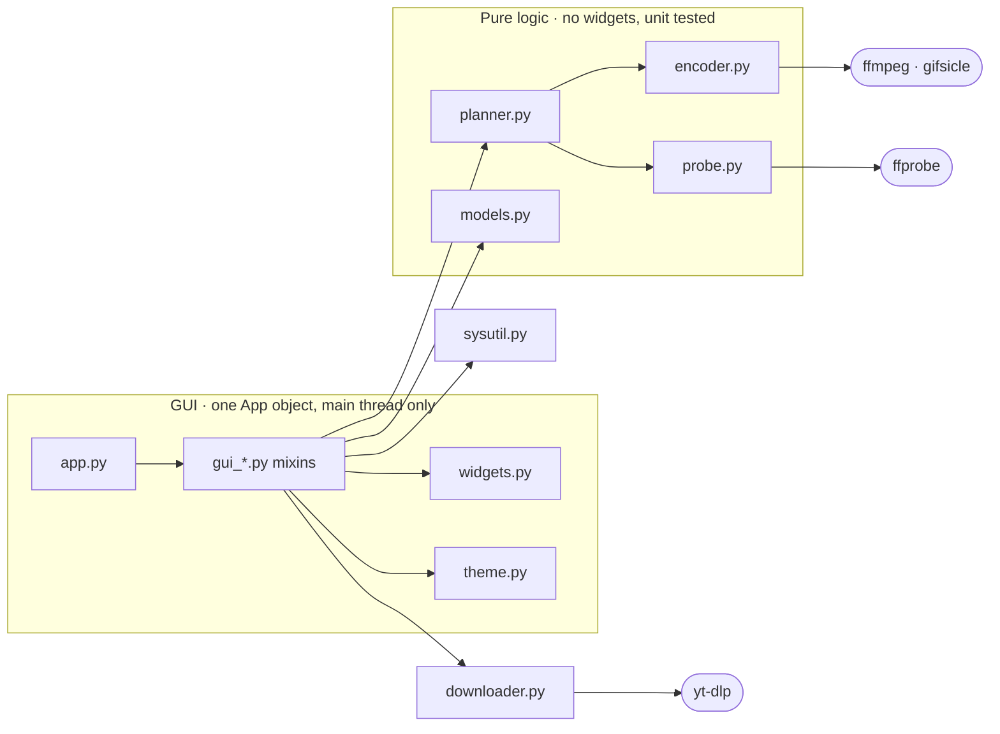

# Development notes

How the app is put together, how a change ships, and the gotchas that were
learned the hard way. Read this before touching the ffmpeg pin or the release
workflow.

## Architecture

| Module | Responsibility |
|---|---|
| `app.py` | Composes the `App` class from the `gui_*` mixins; holds only `__init__`, shutdown, and the entry point. |
| `gui_build.py` | Constructs every widget: header, toolbar, queue area, the settings card for all tabs, tooltips, short-screen fallback. |
| `gui_queue.py` | The file queue: add/drop/remove/reorder, selection, the details line, probing, opening results in Explorer. |
| `gui_downloads.py` | The Download tab: clipboard prefill, starting yt-dlp jobs, turning finished downloads into rows. |
| `gui_notes.py` | The advisory layer: per-mode notes, per-row output size estimates, GIF/image preview thumbnails and the scrubber. |
| `gui_settings.py` | Settings state: which controls each tab/mode shows, greying rules, and snapshotting widgets into a settings dict. |
| `gui_run.py` | Running a batch: validation, output planning, the encode worker, progress, the message pump, GPU/update probes. |
| `gui_config.py` | Persistence: the config file and named setting presets. |
| `models.py` | Constants (tabs, modes, dropdown options), the `Job` dataclass, small pure helpers (`status_display`, `unique_path`, `kind_icon`). |
| `encoder.py` | Builds and runs every ffmpeg command: `build_stages` (video, all codecs and modes), `build_gif_stages`, `build_image_stages`, `build_audio_stages`, `build_cut_stages`, plus the size math (`video_bitrate_for_target`, `suggest_parts`). |
| `planner.py` | Pure planning: `plan_job` turns one queued job + mode + settings snapshot into `(label, command, duration)` stages and 2 pass log paths; `estimate_output_bytes` backs the per-row size predictions; the Target size roomy/tight decision lives here. No widgets or threads, fully unit tested. |
| `probe.py` | Reads metadata via ffprobe (`probe_video` → `VideoInfo`), recommends settings, resolves the bundled ffmpeg/ffprobe/gifsicle paths, detects GPU encoders (`gpu_codecs`, `nvenc_works`), extracts preview frames. |
| `downloader.py` | yt-dlp integration: fetch and self update the binary, build the download command, parse progress, locate the finished file. |
| `widgets.py` | `QueueRow` (the per file list item, draggable), `Tooltip` (static or live text), and `RangeSlider` (the two handle Canvas slider behind the GIF clip and trim ranges). |
| `sysutil.py` | Windows helpers: keep awake, taskbar flash and real taskbar progress (ITaskbarList3 via ctypes), bundled resource paths, GitHub release lookup, self relaunch with a reset PyInstaller environment, and the child process registry (`track_child` / `terminate_children`) that stops window close from orphaning ffmpeg or yt-dlp. |
| `theme.py` | Accent palettes (`ACCENTS`), private font loading, CustomTkinter theme override. `apply_theme(accent)` also rotates every neutral's hue to follow the accent, so a green app gets green tinted darks. |

### The shape at a glance



Dependencies point one way: the GUI knows the pure modules, never the
reverse. Worker threads live on the boundary; they call into the pure
modules and report back through `App.msg_queue` (see Threading model).

### The mixin split

`App` is one class assembled from seven mixins, one per concern. Every method
still lives on the same object (`self.crf_slider` works from any file), so
there is no plumbing between modules; the split is purely for navigability.
When adding a method, put it in the mixin whose docstring matches; if none
fits, that's a hint it belongs in a pure module (`planner.py`, `encoder.py`)
instead.

### Threading model

Tkinter is not thread safe, so the app follows one rule everywhere: **worker
threads never touch widgets**. Long work (probing, encoding, downloading, the
GPU test, the update check) runs in daemon threads that post tuples onto
`App.msg_queue`; the main thread polls it every 100 ms (`_poll_queue` →
`_dispatch`) and updates the UI. Settings are snapshotted on the main thread
when a run starts, so mid run UI changes cannot corrupt a batch.

### Layout

The bottom bar (progress, status, Start/Cancel) is packed `side="bottom"`
first, so it is always visible. The middle section (queue, tabs, settings) is
built by `_build_middle(parent)`; at startup the app measures its required
height against the screen and, when it does not fit (small laptops, high DPI
scaling), rebuilds the middle inside a `CTkScrollableFrame`
(`_make_middle_scrollable`).

Window sizing is **measured, never hardcoded**: height comes from the tallest
tab (Compress) and width from the widest (`_widest_tab_reqwidth`, the GIF tab
with its preview column). Opening the Advanced section grows the window if
needed (`_fit_window_height`); it never shrinks a user dragged size. If a new
control clips at the default size, the measurement is what to fix, not a
pixel constant.

### Live re-theming and the settings panel

CustomTkinter widgets take their colors at creation, so changing the accent
rebuilds the UI in place: `_apply_accent` → `_rebuild_ui` snapshots every
control through the preset machinery, destroys all widgets, rebuilds, and
re-attaches the queue rows from `self.jobs` (thumbnails are cached on the
Job). **Rows must be detached first** (`job.row = None`): anything that
renders rows mid rebuild (the estimate refresher) would otherwise touch
destroyed widgets and wedge the UI. The app settings (accents + About) are an
in window panel that swaps places with `self._middle`, not a Toplevel.

### Tabs and modes

The five tabs map to internal modes via `App._mode()`: the Compress tab uses
the segmented sub mode (quality/target/split), while GIF, Images, Audio, and
Download tabs are modes of their own. Each tab only processes its own kind of
file (`models.is_image` / `is_audio`); everything else in the queue is left
untouched.

## How a change ships

1. Commit and push to `main`. CI lints (`ruff check .`, configured in
   `pyproject.toml`) and runs the test suite on a Windows runner.
2. Bump `APP_VERSION` in `models.py`, commit, push.
3. `git tag vX.Y.Z && git push origin vX.Y.Z`
4. On GitHub: create a release from that tag. CI builds the exe (downloading
   its own pinned ffmpeg) and attaches it to the release.
5. Every installed copy checks the latest release at startup and shows an
   update link in the header when it is newer than `APP_VERSION`.

**Releases build from the workflow as it exists at the tagged commit.** A tag
placed before a workflow fix will faithfully rebuild the old, broken recipe.
When in doubt, verify before publishing:

```powershell
git show vX.Y.Z:.github/workflows/ci.yml | Select-String ffmpeg
git show vX.Y.Z:models.py | Select-String APP_VERSION
```

A sanity check that has caught real bugs three times: **compare the release
exe size against a local build**. Unexplained size differences mean different
ingredients.

## Gotchas (each one cost a broken release or a debugging session)

### ffmpeg pinning
- CI must bundle gyan's **full** build, not essentials: essentials lacks
  `libsvtav1`, silently breaking CPU AV1 encoding (v1.0 shipped this bug).
  `tests/test_ffmpeg_smoke.py` now fails loudly if the wrong build sneaks in.
- The pin is **7.1.1** deliberately: ffmpeg 8.x NVENC requires NVIDIA driver
  610+, which would silently break GPU encoding for most users (v1.0.1
  shipped this bug). When bumping the pin, run the encode matrix and a real
  NVENC encode on actual hardware first.
- The download is verified against a pinned SHA256 in `ci.yml` (both the test
  and build jobs). When bumping the pin, compute the new hash with
  `Get-FileHash` and update `FFMPEG_SHA256` alongside `FFMPEG_URL`.
- Subprocess text streams that can echo file names (`run_encode`,
  `probe_video`, yt-dlp) must pass `encoding="utf-8", errors="replace"`:
  the Windows locale codec (cp1252) raises on many UTF-8 bytes and would
  fail an otherwise healthy encode of a non ASCII file name.
- Local builds bundle whatever `Get-Command ffmpeg` finds. A polluted global
  Python also bloats local exes (PyInstaller bundles importable extras like
  numpy); the CI exe from a clean environment is the canonical artifact.
- **gifsicle** (lossy GIF pass) is pinned the same way: 1.95 win64 from the
  official Windows builds, `GIFSICLE_URL`/`GIFSICLE_SHA256` in `ci.yml`,
  bundled by `build.ps1` (which requires it on PATH, next to ffmpeg on dev
  machines). The Lossy menu hides itself when gifsicle is missing
  (`probe.has_gifsicle`), same pattern as the GPU option.

### Trimming and timeline filters
- `-ss` **and** `-t` must both precede `-i` (input side trim). With `-t`
  after `-i` it caps the OUTPUT instead, which breaks every filter that
  stretches the timeline (boomerang lost its bounce, speed covered the wrong
  source span in v1.2.0) and forces palette GIFs to read the whole source
  before writing a frame. A unit test pins the argument order and the smoke
  tests assert real output durations.
- `setpts` (speed) goes BEFORE the `fps` filter so the rate change actually
  drops/duplicates frames; `mpdecimate` (skip still frames) goes AFTER `fps`,
  which would otherwise re-duplicate what it removed.

### Target size never inflates
- A cap far above what the video needs (12 MB clip, 500 MB target) must not
  be "hit": `plan_job` compares the quality bitrate estimate against the cap
  and, when it fits with 1.2x margin, encodes at constant quality with a VBV
  ceiling instead of 2 pass ABR. The ceiling is clamped to 4x the quality
  estimate: the raw cap's doubled bufsize can overflow ffmpeg's 32 bit field
  (a 500 MB / 3 s cap is ~1.3M kbps). Tight caps keep the precise 2 pass.

### PyInstaller self-relaunch
- A onefile exe that spawns itself must scrub `_PYI*`/`_MEIPASS*` from the
  child environment and set `PYINSTALLER_RESET_ENVIRONMENT=1`
  (`sysutil._relaunch_env`), or the child reuses the parent's `_MEI` temp
  directory and dies when the parent exits ("failed to start embedded python
  interpreter"). Themes no longer restart, but the helper stays for anything
  that does.

### yt-dlp
- `--ignore-config` is mandatory: a user's own yt-dlp config (for example
  `-f worst`) would otherwise hijack every download on every site.
- `--print` implies quiet, which suppresses progress lines; `--progress`
  forces them back on.
- The frozen yt-dlp exe drops non ASCII characters from its piped output, so
  the printed file path is unreliable for unicode titles;
  `newest_media_file()` finds the finished file by timestamp as a fallback.
- A stale yt-dlp gets quietly served low resolutions by sites (no error, just
  a pixelated file). `update_ytdlp_if_stale()` self updates before
  downloading when the local copy is over a week old.

### GPU encoding
- Encoder presence in the ffmpeg build says nothing about the machine: AMD
  and Intel GPUs, or old NVIDIA drivers, fail at encode time. `nvenc_works()`
  runs a real one frame test encode in the background on first launch and
  caches the verdict in the config (`nvenc_ok`).

### Color and HDR
- Everything pins `yuv420p` for playability, **except** 10 bit sources going
  to H.265/AV1, which keep 10 bit (`yuv420p10le` / `p010le` on NVENC).
- HDR (PQ/HLG) squeezed to 8 bit SDR without tone mapping looks washed out;
  `encoder.TONEMAP` (a zscale + hable chain) handles H.264 and GIF outputs
  from HDR sources.

### Subtitles burn-in
- The `subtitles=` filter's filename goes through **two** rounds of ffmpeg
  string parsing (the filtergraph, then the filter's options), so it needs two
  levels of backslash escaping and no quoting: `C:\x.srt` becomes
  `C\\:/x.srt` (`encoder._subtitles_filter`). Single quoting looks right and
  passes a naive test, but breaks on the second parse; the smoke test
  (`test_rotate_and_subtitles_end_to_end`) burns a real subtitle from a path
  with an apostrophe to keep this honest.

### Misc
- One quality slider maps across codec scales via `CODECS[...]["crf_off"]`
  (x265 CRF 23 ≈ x264 CRF 19 ≈ SVT-AV1 CRF 30).
- x265 two pass uses `-x265-params pass=N`; x264 uses native `-pass N`;
  SVT-AV1 target mode is single pass ABR.
- Output paths are deduplicated per batch (`unique_path`) so same named
  inputs cannot overwrite each other's results.
- The config lives at `~/.laxy_compressor.json`; the last download log at
  `%LOCALAPPDATA%\LaxyCompressor\last_download.log`.
