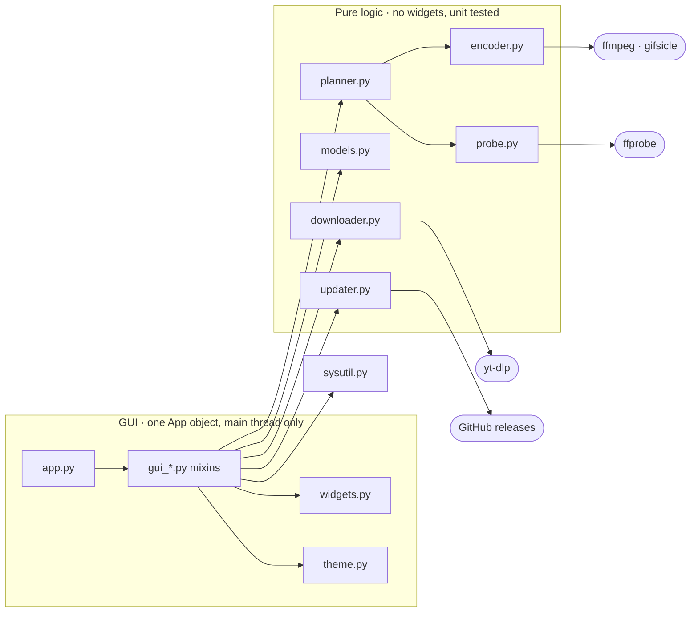

# Development notes

How the app is put together, how to work on it, how a release ships, and the
gotchas that were learned the hard way. Read [Releasing](#releasing) and
[Packaging and CI](#packaging-and-ci) before touching the ffmpeg pin or the
workflow.

**Contents:** [Getting started](#getting-started) ·
[Architecture](#architecture) · [Testing](#testing) ·
[Releasing](#releasing) · [Gotchas](#gotchas)

## Getting started

You need:
- **Python 3.10**, the version CI tests and builds with.
- **ffmpeg 7.1.1, gyan.dev *full* build** on PATH (`ffmpeg.exe` and
  `ffprobe.exe`). Not the essentials build: it lacks the SVT-AV1 encoder. The
  exact zip and its checksum are `FFMPEG_URL` / `FFMPEG_SHA256` in
  `.github/workflows/ci.yml`.
- **gifsicle 1.95** on PATH for the lossy GIF option (`GIFSICLE_URL` in
  `ci.yml`).

```powershell
pip install -r requirements.txt
python app.py                                  # run from source

pip install pytest==9.1.1 ruff==0.15.22        # the versions CI pins
ruff check .                                   # lint (config in pyproject.toml)
pytest -q                                      # unit tests + real ffmpeg smoke tests

pip install pyinstaller==6.21.0
./build.ps1                                    # standalone exe in dist\
& "dist\Laxy Toolbox.exe" --selftest out.json  # writes the resolved tool paths
```

`pytest` needs no display. The smoke tests skip themselves when ffmpeg is not
on PATH (and the lossy GIF test when gifsicle is not).

`build.ps1` bundles whichever ffmpeg, ffprobe, and gifsicle it finds on PATH,
and fails without them. PyInstaller also bundles any importable package it
notices in your Python (numpy, for example), so local exes come out about
10 MB larger than release builds. The CI exe, built in a clean environment,
is the one that ships.

## Architecture

| Module | Responsibility |
|---|---|
| `app.py` | Composes the `App` class from the `gui_*` mixins; holds only `__init__`, shutdown, Tk's exception hook, and the entry point (plus `--selftest`). |
| `gui_build.py` | Constructs every widget: header, toolbar, queue area, the settings card for all tabs, tooltips, the short screen fallback, and live re-theming. |
| `gui_queue.py` | The file queue: add, drop, paste, remove, reorder, selection, the details line, probing, the right click menu, Save a frame, opening results in Explorer. |
| `gui_downloads.py` | The Download tab: clipboard prefill, starting yt-dlp jobs, turning finished downloads into queue rows. |
| `gui_notes.py` | The advisory layer: per mode notes, per row output size estimates, the GIF/trim/image preview thumbnails. |
| `gui_edits.py` | Per file edits from the right click menu: the trim dialog and the crop box dialog. Results live on the Job (`job.trim`, `job.crop`) and win over the shared settings at plan time. |
| `gui_settings.py` | Settings state: which controls each tab and mode shows, greying rules, codec and hardware interplay, and `_collect_settings`, the one funnel from widgets to the plain dicts the planner consumes. |
| `gui_run.py` | Running a batch: validation, output naming, the encode and sample workers, progress, the message pump, the GPU probe, and the update flow. |
| `gui_config.py` | Persistence: the config file, presets (built in and saved), and the settings panel. |
| `models.py` | Constants (tabs, modes, menu options), the `Job` dataclass, and pure helpers: `status_display`, `friendly_error`, `unique_path`, `same_path`, `parse_time`. |
| `encoder.py` | Builds and runs every ffmpeg command: `build_stages` (video, all codecs and modes), `build_gif_stages`, `build_image_stages`, `build_audio_stages`, `build_cut_stages`, `run_encode`, and the size math (`video_bitrate_for_target`, `suggest_parts`). |
| `planner.py` | Pure planning: `plan_job` turns one job, a mode, and a settings snapshot into `(label, command, duration)` stages plus 2 pass log paths; `estimate_output_bytes` backs the size predictions; the Target size roomy or tight decision lives here. |
| `probe.py` | ffprobe metadata (`probe_video` → `VideoInfo`, in decoded orientation), settings recommendations, bundled tool paths, GPU detection (`gpu_vendors`, `gpu_works`), crop detection, preview frames. |
| `downloader.py` | yt-dlp: verified fetch and self update, the download command, progress parsing, the staging folder download, locating finished files. |
| `updater.py` | In app updating: release asset lookup with GitHub's sha256 digest, a verified download, and the rename swap that replaces the running exe. Pure functions returning error strings. |
| `widgets.py` | `QueueRow` (one draggable queue item), `Tooltip` (static or live text), and `RangeSlider` (the two handle Canvas slider). |
| `sysutil.py` | Windows helpers: keep awake, taskbar flash and progress (ITaskbarList3 via ctypes), the clipboard, resource paths, relaunch, version comparison, the child process registry and `kill_tree`, `point_on_screen`, and `log_error`. |
| `theme.py` | Accent palettes (`ACCENTS`), private font loading, the CustomTkinter theme override. `apply_theme(accent)` also rotates every neutral's hue toward the accent. |

### The shape at a glance


```mermaid
flowchart LR
    subgraph gui["GUI · one App object, main thread only"]
        app[app.py] --> mixins["gui_*.py mixins"]
        mixins --> widgets[widgets.py]
        mixins --> theme[theme.py]
    end
    subgraph pure["Pure logic · no widgets, unit tested"]
        planner[planner.py] --> encoder[encoder.py]
        planner --> probe[probe.py]
        models[models.py]
        downloader[downloader.py]
        updater[updater.py]
    end
    mixins --> planner
    mixins --> models
    mixins --> downloader
    mixins --> updater
    mixins --> sysutil[sysutil.py]
    encoder --> ffmpeg([ffmpeg · gifsicle])
    probe --> ffprobe([ffprobe])
    downloader --> ytdlp([yt-dlp])
    updater --> github([GitHub releases])
```

Dependencies point one way: the GUI knows the pure modules, never the
reverse. Worker threads live on the boundary; they call into the pure modules
and report back through `App.msg_queue`.

### The mixin split

`App` is one class assembled from eight mixins, one per concern. Every method
lives on the same object (`self.crf_slider` works from any file), so there is
no plumbing between them; the split is purely for navigability. When adding a
method, put it in the mixin whose docstring matches. If none fits, that is a
hint it belongs in a pure module (`planner.py`, `encoder.py`) instead.

### Threading model

Tkinter is not thread safe, so one rule holds everywhere: **worker threads
never touch widgets**. Long work (probing, encoding, downloading, frame
grabs, the GPU test, the update check) runs in daemon threads that put tuples
on `App.msg_queue`. The main thread drains it every 100 ms
(`_poll_queue` → `_dispatch`) and updates the UI.

- A worker that needs an arbitrary main thread call posts
  `("ui", fn, *args)`. Calling `widget.after()` from the worker is still a Tk
  call from the wrong thread.
- Settings are snapshotted on the main thread when a run starts, so changes
  mid run cannot corrupt a batch.
- Workers always post their done message (`all_done`, `sample_done`), even
  after an unexpected exception, or the window stays locked in "running".

### Layout

The bottom bar (progress, status, Start and Cancel) is packed
`side="bottom"` first, so it is always visible. The middle section (queue,
tabs, settings) is built by `_build_middle(parent)`; when its required height
does not fit the screen (small laptops, heavy display scaling), it is rebuilt
inside a `CTkScrollableFrame` (`_make_middle_scrollable`).

Window sizing is **measured, never hardcoded**: height comes from the tallest
tab (Compress) and width from `_widest_tab_reqwidth`, which measures every
tab. Tab frames prefer growing wide over tall, because the tallest tab sets
the height. Opening Advanced grows the window if needed
(`_fit_window_height`) but never shrinks a size the user dragged. If a new
control clips at the default size, fix the measurement, not a pixel constant.

### Live re-theming and the settings panel

CustomTkinter widgets take their colors at creation, so changing the accent
rebuilds the UI in place: `_apply_accent` → `_rebuild_ui` snapshots every
control through the preset machinery, destroys all widgets, rebuilds them,
and re-attaches the queue rows from `self.jobs` (thumbnails are cached on the
Job). The settings panel (accents and About) swaps places with
`self._middle` inside the main window; it is not a separate window.

### Tabs and modes

The five tabs map to internal modes via `App._mode()`: the Compress tab uses
its segmented sub mode (quality, target, split), while GIF, Images, Audio,
and Download are modes of their own. Each tab only processes its own kind of
file (`models.is_image` / `is_audio`).

### Where data lives

| What | Where | Owner |
|---|---|---|
| Settings, window geometry, presets, GPU verdicts (`gpu_ok`) | `~/.laxy_compressor.json` | `gui_config` (written to a temp file, then `os.replace`) |
| `yt-dlp.exe`, `last_download.log`, `errors.log` | `%LOCALAPPDATA%\LaxyCompressor\` (`sysutil.DATA_DIR`) | `downloader`, `sysutil.log_error` |
| 2 pass stats (`vc_<pid>_<job>_pass*`), flattened alpha PNGs (`vc_flat_*`), 5 second samples (`laxy_sample_*`) | `%TEMP%` | `planner` and `gui_run`; swept after each job and on close |
| Download staging (`.laxy_download_*`) | inside the output folder | `downloader`; removed when the download ends |
| Update leftovers (`.new`, `.old`) | next to the exe | `updater`; swept at startup |

## Testing

- **Unit tests** cover the pure modules without a window: command building,
  planning, estimates, probe parsing, error messages, the downloader, and the
  updater. ffprobe, `urlopen`, and yt-dlp are faked where needed (the
  download tests run a fake yt-dlp written in Python).
- **Smoke tests** (`tests/test_ffmpeg_smoke.py`) run real encodes against the
  pinned ffmpeg and assert codecs, durations, and frame shapes. They catch
  the bugs unit tests can't: commands that are built right but that ffmpeg
  rejects. The sample clip has a non ASCII name on purpose.
- **GUI changes** get a scripted smoke test that builds the real `App`:
  1. Set `App._save_config = lambda self: None` before building it, so the
     test never writes the real config.
  2. Build it the way `app.py`'s `__main__` does (fonts, theme), then
     `app.withdraw()`.
  3. **Clear `app.outdir_entry` straight away.** `_load_config` restores the
     real Save to folder, and a test batch would write into it.
  4. Point `sysutil.DATA_DIR` and `sysutil.ERROR_LOG` at a temp folder.
  5. Drive it by calling handlers (`_add_paths`, `on_start`, ...) and pump
     `app.update()` in a loop until a condition holds, instead of
     `mainloop()`.

  For screenshots, `deiconify()`, set `-topmost`, and grab
  `winfo_rootx/rooty/width/height` with `PIL.ImageGrab`. `docs/screenshot.png`
  was made that way from generated sample media.
- **The in app updater** only exists in a frozen build. To test it end to end,
  temporarily set `APP_VERSION` below the latest published release, build,
  launch, and click the update chip: it downloads the real release and swaps
  itself. Revert the version edit right after building and never commit it.

## Releasing

CI (`.github/workflows/ci.yml`) runs the `test` job on every push and pull
request: ruff, the pinned ffmpeg and gifsicle download (checksum verified),
and pytest on a Windows runner. The `build` job only runs when a GitHub
release is published.

1. Push the changes to `main` and wait for CI to pass.
2. Bump `APP_VERSION` in `models.py`, rename CHANGELOG's `## Unreleased`
   heading to `## vX.Y.Z · YYYY-MM-DD`, commit as `vX.Y.Z`, push, and wait
   for CI again.
3. Tag that commit and push the tag:
   `git tag vX.Y.Z` then `git push origin vX.Y.Z`.
4. **Check what the tag will build.** The release build uses the workflow
   as it exists at the tagged commit, so a tag placed before a workflow fix
   faithfully rebuilds the old, broken recipe:
   ```powershell
   git show vX.Y.Z:models.py | Select-String APP_VERSION
   git show vX.Y.Z:.github/workflows/ci.yml | Select-String FFMPEG_URL
   ```
5. On GitHub, draft a release from the tag and paste the CHANGELOG section as
   the notes. Publishing starts the build job, which attaches the exe as
   `Laxy.Toolbox.exe` (GitHub turns the space into a dot).
6. **Check the attached exe.** It should carry a sha256 digest, and its size
   should be close to the previous release's (v1.6.0 through v1.7.1 are all
   about 139.0 million bytes). An unexplained jump means different
   ingredients, such as the wrong ffmpeg build. Compare against earlier
   releases, not a local build, which carries extras from your own Python.
   This check has caught real bugs three times.

Every installed copy checks the latest release at startup and turns the
version label into an update button when the release is newer and has an exe
attached. Clicking it downloads the exe to `.new` (length checked and
verified against the asset's sha256 digest), renames the running exe to
`.old`, renames `.new` into place, and relaunches. A running exe cannot be
overwritten but CAN be renamed, which is the whole trick. The `.old` stays
until the next startup sweeps it, so a failed install always rolls back to a
working exe, and any failure falls back to opening the release page. Dev runs
never self update.

## Gotchas

Each of these cost a broken release or a long debugging session.

### Packaging and CI

- CI must bundle gyan's **full** ffmpeg build, not essentials: essentials
  lacks `libsvtav1`, silently breaking CPU AV1 (v1.0 shipped this bug).
  `test_bundled_ffmpeg_has_cpu_av1` fails loudly if the wrong build sneaks in.
- The pin is **7.1.1** on purpose: ffmpeg 8.x NVENC needs NVIDIA driver 610
  or newer, which silently breaks GPU encoding for most users (v1.0.1 shipped
  this bug). Before bumping it, run the encode matrix and a real NVENC encode
  on actual hardware, then update `FFMPEG_URL` and `FFMPEG_SHA256` (compute
  the hash with `Get-FileHash`) in both jobs.
- **gifsicle** is pinned the same way (`GIFSICLE_URL` / `GIFSICLE_SHA256`).
  The Lossy menu hides itself when gifsicle is missing
  (`probe.has_gifsicle`), the same pattern as the GPU option.
- pytest, ruff, and PyInstaller are pinned in `ci.yml` so a new release of a
  tool can't turn an unchanged commit red. The third party release action is
  pinned to a commit SHA, because it has write access to the releases the in
  app updater downloads from. Bump all of these deliberately.
- A onefile exe that starts a copy of itself must scrub `_PYI*` and
  `_MEIPASS*` from the child's environment and set
  `PYINSTALLER_RESET_ENVIRONMENT=1` (`sysutil._relaunch_env`). Otherwise the
  child reuses the parent's `_MEI` temp folder and dies when the parent exits
  ("failed to start embedded python interpreter").

### Building ffmpeg commands

- **Trim on the input side.** `-ss` **and** `-t` must both come before `-i`.
  With `-t` after `-i` it caps the OUTPUT instead, which breaks every filter
  that stretches the timeline (boomerang lost its bounce and speed covered the
  wrong part of the video in v1.2.0) and makes palette GIFs read the whole
  source first. A unit test pins the order; smoke tests assert real durations.
- **Never seek into a still image.** An input side `-ss 0` on a single JPEG
  makes ffmpeg exit with code 0 and write nothing, which silently left every
  photo without a thumbnail, an Images preview, or a crop box frame.
  `extract_frame_png` only seeks when the time is above 0.
- **Filter order.** `setpts` (speed) goes BEFORE `fps`, so the rate change
  really drops or duplicates frames; `mpdecimate` (skip still frames) goes
  AFTER `fps`, which would otherwise re-duplicate what it removed. Subtitles
  burn in BEFORE `setpts`: they render on the original clock and drift after
  retiming.
- **Speed changes** re-encode the audio (`atempo` covers 0.5x to 100x per
  instance, so 0.25x chains two 0.5x stages; copy silently becomes AAC). Size
  targeting and progress both work in OUTPUT seconds (`duration / speed`).
- **Target size never inflates.** When the cap is far above what a video
  needs (a 12 MB clip with a 500 MB target), `plan_job` encodes at constant
  quality with a VBV ceiling instead of 2 pass ABR, when the quality estimate
  fits with 1.2x margin. The ceiling is clamped to 4x that estimate, because
  the raw cap's doubled bufsize can overflow ffmpeg's 32 bit field (a 500 MB
  cap on 3 s is about 1.3M kbps). Tight caps keep the precise 2 pass.
- **x265 2 pass** uses `-x265-params pass=N:stats=<passlog>.log`, escaped for
  the key=value:key=value string. x265 ignores `-passlogfile` and otherwise
  writes `x265_2pass.log` into the working directory, where a read only
  folder fails the encode. x264 uses native `-pass N` with `-passlogfile`;
  SVT-AV1 target mode is single pass ABR.
- **One quality slider** maps across codec scales via
  `CODECS[...]["crf_off"]` (x265 CRF 23 ≈ x264 CRF 19 ≈ SVT-AV1 CRF 30).
- **Burned in subtitles:** the `subtitles=` filename is parsed **twice** (the
  filtergraph, then the filter's own options), so it needs two levels of
  backslash escaping and no quoting: `C:\x.srt` becomes `C\\:/x.srt`
  (`encoder._subtitles_filter`). Quoting looks right and passes a naive test
  but breaks on the second parse; `test_rotate_and_subtitles_end_to_end`
  burns a real subtitle from a path with an apostrophe.
- **Audio track mixing** builds an `amix` complex filtergraph with
  `normalize=0` (the default divides each track by the track count, halving
  game and mic). A `-vf` next to `-filter_complex` is fine because they touch
  different streams, but `-af` on a stream fed by the complex graph is an
  ffmpeg error, so boost's `loudnorm` joins the amix graph. A mix can't be
  stream copied, so copy falls back to AAC. Each file's own track count
  (`audio_track_count`) sizes its graph.
- **Color and HDR:** everything pins `yuv420p` for playability, except 10 bit
  sources going to H.265 or AV1, which stay 10 bit (`yuv420p10le`, `p010le`
  on NVENC). HDR (PQ or HLG) squeezed into 8 bit SDR without tone mapping
  looks washed out, so `encoder.TONEMAP` (zscale + hable) runs for H.264 and
  GIF outputs from HDR sources.
- **Per file edits** (`job.trim`, `job.crop`) win over the shared Trim fields
  and Crop menu in `plan_job`. Anything that mirrors plan time behaviour
  (estimates, notes, split part counts, `_outputs_for`) must apply the same
  `job.x or settings[...]` precedence.

### GPU encoding

- Encoder presence in the ffmpeg build says nothing about the machine: the
  wrong GPU brand or an old driver fails at encode time. `gpu_works(vendor)`
  runs a real one frame test encode per vendor (NVENC, AMF, QSV) in the
  background on first launch and caches the verdicts in the config (`gpu_ok`;
  the old `nvenc_ok` bool is migrated on load).
- Each vendor has its own constant quality dialect: NVENC `-cq`, AMF
  `-rc cqp` with `-qp_i`/`-qp_p` (plus `-qp_b` on H.264), QSV
  `-global_quality` (ICQ). All sit on roughly the 0 to 51 scale **except AV1
  on AMF, which quantizes 0 to 255** (the app multiplies by 5).
- The roomy target VBV ceiling only exists on x264, x265, and NVENC. AMF CQP
  and QSV ICQ ignore or reject `-maxrate`, so they rely on the planner's
  headroom margin (like SVT-AV1).
- A machine can pass the probe for one vendor and fail another (a Ryzen APU
  plus an NVIDIA card passes NVENC and AMF, fails QSV), and a vendor can pass
  H.265 but lack AV1 hardware; that encode then fails with the friendly GPU
  error.

### Files, paths, and text

- **Subprocess text must be UTF-8.** Every call that reads text from ffmpeg,
  ffprobe, or yt-dlp passes `encoding="utf-8", errors="replace"`. Their logs
  echo file names, and the Windows locale codec (cp1252) fails on bytes common
  in CJK names: an encode crashed, or crop detection silently found nothing.
- **Windows paths are case insensitive.** `IMG_0001.JPG` converted to JPEG is
  `IMG_0001.jpg`, the SAME file, and ffmpeg happily rewrote the original in
  place. Compare with `models.same_path` / `norm_path`, never raw
  `os.path.abspath` equality. `on_start` also seeds `unique_path`'s claimed
  set with every queued source, so no output can take a path another job
  still has to read.
- **Rotation metadata.** Phones store portrait video as landscape plus a
  Display Matrix rotation, and ffmpeg autorotates whenever it decodes.
  `probe_video` swaps width and height for 90 and 270 degrees, so `VideoInfo`
  describes the picture every filter (crop box, scale, estimates) actually
  sees.

### Child processes and downloads

- **Kill process trees.** `yt-dlp.exe` is a PyInstaller onefile: the process
  we start is only a launcher, and the real downloader is its child.
  `proc.terminate()` leaves that child (and its ffmpeg merge) running, so
  children are stopped with `sysutil.kill_tree` (`taskkill /T`). Every long
  running child is registered (`track_child`) so closing the window kills it.
- **Downloads use a staging folder.** yt-dlp writes into a private
  `.laxy_download_*` folder inside the output folder, and finished files move
  out at the end. The sweep for mangled paths only sees this download's own
  files, never a browser download or another job's output, and a cancel or
  failure deletes the partials wholesale. Cancel is watched from its own
  thread, because an ffmpeg merge can print nothing for minutes.
- **Verify what you download and later run.** A dropped connection just ends
  the stream early, so downloads are length checked and hash verified:
  `updater.download` against GitHub's asset digest, `fetch_ytdlp` against
  yt-dlp's `SHA2-256SUMS`. A damaged `yt-dlp.exe` (WinError 193 or 216) is
  deleted and fetched again, since it can't run `-U` to repair itself.
- **yt-dlp flags that matter:**
  - `--ignore-config`: a user's own yt-dlp config (such as `-f worst`) would
    otherwise hijack every download.
  - `--progress`: `--print` implies quiet, which hides the progress lines.
  - `--ffmpeg-location`: yt-dlp needs ffmpeg to merge HD video and audio
    streams and can't see the copy bundled inside the exe. Without it, YouTube
    falls back to the single pre-merged 360p format.
- **yt-dlp quirks:** the frozen exe drops non ASCII characters from its piped
  output, so the printed file path is unreliable for unicode titles; the
  staging folder sweep finds the real file. A stale yt-dlp is quietly served
  low resolutions (no error, just a worse file), so
  `update_ytdlp_if_stale()` self updates before downloading when the copy is
  over a week old.

### UI

- **Every widget must be unconditionally in one of `_refresh_mode`'s show
  lists.** Conditional list membership means nothing ever hides the widget on
  the other tabs.
- **Clearing a CTkLabel image** needs `label._label.configure(image="")`
  before dropping the CTkImage reference; `configure(image=None)` leaves the
  inner Tk label pointing at a garbage collected image, which breaks the next
  configure.
- **Detach rows before a rebuild** (`job.row = None`): anything that renders
  rows mid rebuild (the estimate refresher) would otherwise touch destroyed
  widgets and wedge the UI.
- **Errors must not vanish.** The windowed exe has no console. `_poll_queue`
  reschedules itself in a `finally` and logs a failing message instead of
  stopping, and Tk callback exceptions go through
  `App.report_callback_exception`. Everything lands in
  `%LOCALAPPDATA%\LaxyCompressor\errors.log` (`sysutil.log_error`); ask for
  that file in bug reports.
